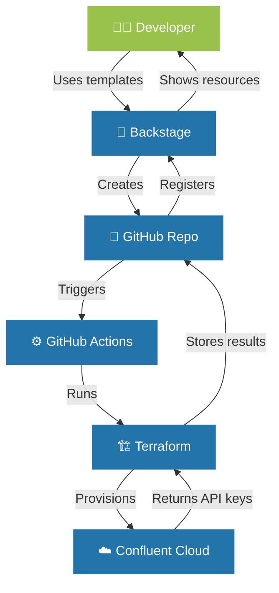

## Introduction


In this comprehensive guide, I'll walk you through the process of building a self-service developer platform using Spotify's Backstage as the foundation and Confluent Cloud as a key service offering. This step-by-step tutorial will take you from a basic Backstage installation to a full-featured platform that enables developers to provision their own Confluent Cloud environments and clusters via a streamlined, GitOps-driven workflow.

Following diagram visualizes the flow of the application.




## What We'll Cover

1. Setting up a new Backstage project
2. Setting up a GitHub Personal Access Token
3. Configuring GitHub authentication and GitHub Actions
4. Setting up the organizational structure
5. Creating first static software catalog entry for Confluent Cloud
6. Building a custom plugin for Confluent Cloud integration
7. Creating templates for Confluent Cloud provisioning
8. Creating a Cluster Template
9. Update App Configuration
10. Start Your Backstage App

## Prerequisites

- Node.js 16 or later
- Yarn
- Docker (for TechDocs)
- Git
- A GitHub account
- A Confluent Cloud account with API keys

## Step 1: Setting Up a New Backstage Project

Let's start by creating a new Backstage project:

```bash
# Install the Backstage CLI
npm install -g @backstage/cli

# Create a new Backstage app
npx @backstage/create-app

# Follow the prompts to set up your app
# For this tutorial, we'll name it "confluent-backstage"
```

After the installation completes, navigate to your new project:

```bash
cd confluent-backstage
```

## Step 2: Setting up a GitHub Personal Access Token

Before we proceed to GitHub authentication, you'll need to create a personal access token that allows Backstage to interact with GitHub's API. This is necessary for repository creation and other GitHub operations.

1. Go to your GitHub account settings
2. Navigate to "Developer settings" → "Personal access tokens" → "Fine-grained tokens" → "Generate new token"
3. Give your token a descriptive name like "Backstage Integration"
4. Set an expiration date (I recommend at least 90 days)
5. For repository access, select "All repositories" or specifically select the repositories you'll be using
6. Under "Repository permissions", grant the following permissions:
   - Contents: Read and write
   - Pull requests: Read and write
   - Workflows: Read and write
   - Metadata: Read-only
7. Generate the token and copy it immediately (you won't be able to see it again)

Now, set this token as an environment variable:

```bash
export GITHUB_TOKEN=your_personal_access_token
```

To make this persistent, add it to your `.env` file:

```
GITHUB_TOKEN=your_personal_access_token
```

Also check the `app-config.yaml` file that backstage uses this token for GitHub integration (Should be there by default):

```yaml {filename="app-config.yaml"}
integrations:
  github:
    - host: github.com
      token: ${GITHUB_TOKEN}
```

Start the app in development mode to make sure the initial setup of backstage is working properly:

```bash
yarn dev
```

This will launch your Backstage app at http://localhost:3000. 
Sign in as guest for now. You should see the default Backstage welcome page.



  Make sure that your browser can access localhost:3000 and localhost:7007. Both ports are needed for the app to work.
  If needed they can be changed in the `app-config.yaml` file.


## Step 3: Configuring GitHub Authentication

Next, let's set up GitHub authentication to provide a secure, identity-based access system and leverage the great integration of Backstage with GitHub like the GitHub Actions plugin.

### 3.1 Create a GitHub OAuth App

1. Go to your GitHub account settings
2. Navigate to "Developer settings" → "OAuth Apps" → "New OAuth App"
3. Fill in the following details:
   - Application name: "Confluent Backstage"
   - Homepage URL: "http://localhost:3000"
   - Authorization callback URL: "http://localhost:7007/api/auth/github/handler/frame"
4. Register the application and note the Client ID and Client Secret


### 3.2 Configure Backstage for GitHub Auth

Update your `app-config.yaml` file to include the GitHub authentication provider and GitHub Actions configuration.
Replace the existing auth section with the following:

```yaml {filename="app-config.yaml"}
# GitHub authentication configuration
auth:
  environment: development
  providers:
    github:
      development:
        clientId: ${AUTH_GITHUB_CLIENT_ID}
        clientSecret: ${AUTH_GITHUB_CLIENT_SECRET}
        signIn:
          resolvers:
            - resolver: usernameMatchingUserEntityName

# GitHub integration for repository operations and GitHub Actions
integrations:
  github:
    - host: github.com
      token: ${GITHUB_TOKEN}

# GitHub Actions configuration
github:
  actions:
    allowedDomains: ['github.com']
```

Create or modify the `.env` file in the root of your project to store the GitHub OAuth credentials:

```
AUTH_GITHUB_CLIENT_ID=your_client_id
AUTH_GITHUB_CLIENT_SECRET=your_client_secret
```

You can also set these as environment variables directly:

```bash
export AUTH_GITHUB_CLIENT_ID=your_client_id
export AUTH_GITHUB_CLIENT_SECRET=your_client_secret
```

### 3.3 Update Your App Configuration

Modify your `packages/app/src/App.tsx` file to add the sign-in page component and GitHub Actions plugin:

```typescript {filename="packages/app/src/App.tsx", hl_lines=[4, 6, 7, 30, 31, 32, 33, 34, 35, 36, 37, 38, 39, 40,  48, 49, 50, 51, 52] }
// Other imports...
import { catalogEntityCreatePermission } from '@backstage/plugin-catalog-common/alpha';

import { githubAuthApiRef } from '@backstage/core-plugin-api';
// Import the GitHub Actions plugin components
import { EntityGithubActionsContent } from '@backstage-community/plugin-github-actions';
import { EntityLayout } from '@backstage/plugin-catalog';

const app = createApp({
  apis,
  bindRoutes({ bind }) {
    bind(catalogPlugin.externalRoutes, {
      createComponent: scaffolderPlugin.routes.root,
      viewTechDoc: techdocsPlugin.routes.docRoot,
      createFromTemplate: scaffolderPlugin.routes.selectedTemplate,
    });
    bind(apiDocsPlugin.externalRoutes, {
      registerApi: catalogImportPlugin.routes.importPage,
    });
    bind(scaffolderPlugin.externalRoutes, {
      registerComponent: catalogImportPlugin.routes.importPage,
      viewTechDoc: techdocsPlugin.routes.docRoot,
    });
    bind(orgPlugin.externalRoutes, {
      catalogIndex: catalogPlugin.routes.catalogIndex,
    });
  },
  components: {
    SignInPage: props => (
      <SignInPage
        {...props}
        auto
        provider={{
          id: 'github-auth-provider',
          title: 'GitHub',
          message: 'Sign in using GitHub',
          apiRef: githubAuthApiRef,
        }}
      />
    ),
  },
});

const routes = (
  <FlatRoutes>
    {/* ... other routes ... */}
    <Route path="/catalog/:namespace/:kind/:name" element={<CatalogEntityPage />}>
      <EntityLayout.Route path="/actions" title="Actions">
        <EntityGithubActionsContent />
      </EntityLayout.Route>
    </Route>
    {/* ... other routes ... */}
  </FlatRoutes>
);
```

Install the required packages for the frontend:

```bash
yarn --cwd packages/app add @backstage/core-components @backstage-community/plugin-github-actions
```

Update your backend code in `packages/backend/src/index.ts` to include the auth plugin:

```typescript {filename="packages/backend/src/index.ts", hl_lines=[5]}
// auth plugin
backend.add(import('@backstage/plugin-auth-backend'));
// See https://backstage.io/docs/backend-system/building-backends/migrating#the-auth-plugin
//backend.add(import('@backstage/plugin-auth-backend-module-guest-provider'));
backend.add(import('@backstage/plugin-auth-backend-module-github-provider'));
// See https://backstage.io/docs/auth/guest/provider
```

Install the backend plugins:

```bash
# Install auth plugins
yarn --cwd packages/backend add @backstage/plugin-auth-backend @backstage/plugin-auth-backend-module-github-provider
```

Now, when you navigate to the entity page for a repository managed by Backstage, you'll see an "Actions" tab that shows the GitHub Actions workflows for that repository.



  This integration is particularly valuable for our use case as it allows users to monitor the status of their Terraform deployments directly in Backstage. They can track when an environment or cluster is being provisioned and see any errors that might occur during the process without needing to navigate to GitHub.


## Step 4: Setting Up the Organizational Structure

Now, let's define our organization's structure. Create a directory for our templates and organization data and an `org.yaml` file:

```bash
mkdir -p confluent-self-service-templates
touch confluent-self-service-templates/org.yaml   
```

Add following content to the `org.yaml` file:

```yaml {filename="confluent-self-service-templates/org.yaml"}
apiVersion: backstage.io/v1alpha1
kind: User
metadata:
  name: YOUR_GITHUB_USERNAME
  annotations:
    github.com/login: YOUR_GITHUB_USERNAME
spec:
  profile:
    displayName: "Your Name"
    email: "your.email@example.com"
  memberOf: [guests]

---
apiVersion: backstage.io/v1alpha1
kind: Group
metadata:
  name: guests
spec:
  type: team
  children: []
```

Make sure to replace `YOUR_GITHUB_USERNAME`, `Your Name`, and `your.email@example.com` with your actual GitHub username and contact details.

## Step 5: Creating first static software catalog entry for Confluent Cloud

Create an `entities.yaml` file in the `confluent-self-service-templates` directory:

```bash
touch confluent-self-service-templates/entities.yaml   
```

Add following content to the `entities.yaml` file:

```yaml {filename="confluent-self-service-templates/entities.yaml"}
apiVersion: backstage.io/v1alpha1
kind: System
metadata:
  name: confluent-cloud
spec:
  owner: guests
```

This entry will be used as the root entity for our Confluent Cloud resources in backstage entities graph.

Update the `app-config.yaml` file to include the catalog locations:

First, remove the default example catalog locations that come with a fresh Backstage installation:

```yaml {filename="app-config.yaml"}
locations:
  # Local example data, file locations are relative to the backend process, typically `packages/backend`
  - type: file
    target: ../../examples/entities.yaml

  # Local example template
  - type: file
    target: ../../examples/template/template.yaml
    rules:
      - allow: [Template]

  # Local example organizational data
  - type: file
    target: ../../examples/org.yaml
    rules:
      - allow: [User, Group]
```

Then, add our custom catalog locations:

```yaml {filename="app-config.yaml"}
catalog:
  import:
    entityFilename: catalog-info.yaml
    pullRequestBranchName: backstage-integration
  rules:
    - allow: [Component, System, API, Resource, Location]
  locations:
    # Local organizational data
    - type: file
      target: ../../confluent-self-service-templates/org.yaml
      rules:
        - allow: [User, Group]
        
    # Local entities
    - type: file
      target: ../../confluent-self-service-templates/entities.yaml
```

## Step 6: Building a Custom Plugin for Confluent Cloud Integration

### 6.1 Understanding the Need for a Custom Action

Backstage's scaffolder is designed with security in mind, and for good reason. By default, scaffolder actions cannot access environment variables from the host system - this is a deliberate security measure to prevent templates from accessing sensitive credentials.

However, for our Confluent Cloud integration, we need a way to securely provide API credentials to our templates without hardcoding them. We have two options:

1. **Create a custom action** (the approach we'll use) - This action will safely retrieve the Confluent Cloud credentials from environment variables on the Backstage server and pass them to the templates.

2. **Use a secret manager** - Alternatively, we could integrate with a secret manager like HashiCorp Vault or AWS Secrets Manager.

For this tutorial, we'll create a simple custom action that retrieves the credentials from environment variables and makes them available to our templates in a controlled way.

### 6.2 Create the Custom Action

Let's create a new directory for our custom scaffolder action and a new file `packages/backend/src/plugins/scaffolder/actions/getConfluentCredentials.ts` for the action:

```bash
mkdir -p packages/backend/src/plugins/scaffolder/actions
touch packages/backend/src/plugins/scaffolder/actions/getConfluentCredentials.ts
```


```typescript {filename="packages/backend/src/plugins/scaffolder/actions/getConfluentCredentials.ts"}
import { createTemplateAction } from '@backstage/plugin-scaffolder-backend';

export const createGetConfluentCredentialsAction = () => {
  return createTemplateAction({
    id: 'confluent:credentials:get',
    description: 'Retrieves Confluent API credentials from environment variables',
    
    schema: {
      input: {
        type: 'object',
        properties: {},
        required: [],
      },
      output: {
        type: 'object',
        properties: {
          apiKey: {
            type: 'string',
            title: 'Confluent API Key',
            description: 'The Confluent API Key retrieved from environment variables',
          },
          apiSecret: {
            type: 'string',
            title: 'Confluent API Secret',
            description: 'The Confluent API Secret retrieved from environment variables',
          },
        },
      },
    },
    
    async handler(ctx) {
      const apiKey = process.env.CONFLUENT_CLOUD_API_KEY;
      const apiSecret = process.env.CONFLUENT_CLOUD_API_SECRET;
      
      if (!apiKey || !apiSecret) {
        throw new Error(
          'Confluent API credentials not found in environment variables. ' +
          'Please set CONFLUENT_CLOUD_API_KEY and CONFLUENT_CLOUD_API_SECRET.'
        );
      }
      
      ctx.logger.info('Successfully retrieved Confluent API credentials from environment variables');
      
      ctx.output('apiKey', apiKey);
      ctx.output('apiSecret', apiSecret);
    },
  });
};
```

This action:
1. Creates a custom scaffolder action with ID `confluent:credentials:get`
2. Defines the expected outputs (apiKey and apiSecret)
3. Reads the credentials from environment variables
4. Makes them available as outputs that can be used in subsequent template steps

Create an `index.ts` file in the same directory to export the action:

```bash
touch packages/backend/src/plugins/scaffolder/actions/index.ts
```

```typescript {filename="packages/backend/src/plugins/scaffolder/actions/index.ts"}
export { createGetConfluentCredentialsAction } from './getConfluentCredentials';
```

### 6.3 Register the Custom Action

Now, let's register our custom action with the scaffolder plugin. Create a new file `packages/backend/src/plugins/scaffolder.ts` and modify it:

```bash
touch packages/backend/src/plugins/scaffolder.ts
```

```typescript {filename="packages/backend/src/plugins/scaffolder.ts"}
import { CatalogClient } from '@backstage/catalog-client';
import { createRouter } from '@backstage/plugin-scaffolder-backend';
import { Router } from 'express';
import type { PluginEnvironment } from '../types';
import { ScmIntegrations } from '@backstage/integration';
import { createBuiltinActions } from '@backstage/plugin-scaffolder-backend';
import { createGetConfluentCredentialsAction } from './scaffolder/actions';

export default async function createPlugin(
  env: PluginEnvironment,
): Promise<Router> {
  const catalogClient = new CatalogClient({
    discoveryApi: env.discovery,
  });

  const integrations = ScmIntegrations.fromConfig(env.config);

  // Get all the default actions
  const builtInActions = createBuiltinActions({
    catalogClient,
    integrations,
    config: env.config,
    reader: env.reader,
  });

  // Add our custom action to the list
  const actions = [
    ...builtInActions,
    createGetConfluentCredentialsAction(),
  ];

  return await createRouter({
    actions,
    catalogClient,
    logger: env.logger,
    config: env.config,
    database: env.database,
    reader: env.reader,
  });
}
```

Add a new file `packages/backend/src/types.ts` for the plugin environment:

```bash
touch packages/backend/src/types.ts
```

```typescript {filename="packages/backend/src/types.ts"}
import { Logger } from 'winston';
import { Config } from '@backstage/config';
import { CacheManager, PluginDatabaseManager, PluginEndpointDiscovery } from '@backstage/backend-common';

export type PluginEnvironment = {
  logger: Logger;
  database: PluginDatabaseManager;
  cache: CacheManager;
  config: Config;
  reader: any;
  discovery: PluginEndpointDiscovery;
}; 
```

### 6.3 Add Confluent Cloud Credentials

To interact with Confluent Cloud, you'll need to generate API keys through the Confluent Cloud console. Here's how:

1. Log into the [Confluent Cloud Console](https://confluent.cloud/)
2. Click on the hamburger icon in the top-right corner and select  "Cloud API keys" in the "Administration" section
3. Click the "+Add API key" button in the top-right corner
4. Select "My account" for this tutorial and "Next". (In production, you may want to create a service account for your CI/CD pipeline.)
5. Add a Name and Description for the API key and click "Create API key"
6. Save the API key and secret immediately or download the file to store it safely (you won't be able to see the secret again)


Once you have your API credentials, update your `.env` file to include them:

```
CONFLUENT_CLOUD_API_KEY=your_confluent_api_key
CONFLUENT_CLOUD_API_SECRET=your_confluent_api_secret
```

You can also set these as environment variables directly:

```bash
export CONFLUENT_CLOUD_API_KEY=your_confluent_api_key
export CONFLUENT_CLOUD_API_SECRET=your_confluent_api_secret
```

## Step 7: Creating Templates for Confluent Cloud Provisioning

Now, let's create templates for provisioning Confluent Cloud resources. We'll start with an environment template.

### 7.1 Create the Environment Template

Create a directory for the environment template and a template definition file in `confluent-self-service-templates/environment-template/template.yaml`:

```bash
mkdir -p confluent-self-service-templates/environment-template/
touch confluent-self-service-templates/environment-template/template.yaml
```

```yaml {filename="confluent-self-service-templates/environment-template/template.yaml"}
apiVersion: scaffolder.backstage.io/v1beta3
kind: Template
metadata:
  name: confluent-cloud-environment  
  title: Deploy Confluent Cloud Environment
  description: A Backstage template to create a Confluent Cloud environment using Terraform.
spec:
  owner: group:guests
  type: service

  parameters:
    - title: Confluent Cloud Configuration
      required:
        - environment_name
      properties:
        environment_name:
          title: Environment Name
          type: string
          description: Name of the Confluent Cloud environment.
  steps:
    # Get Confluent credentials from environment variables
    - id: get-credentials
      name: Get Confluent Credentials
      action: confluent:credentials:get

    - id: fetch-repository
      name: Fetch Repository
      action: fetch:template
      input:
        url: ./content
        copyWithoutTemplating:
          - terraform-deploy.yml
        values:
          environment_name: ${{ parameters.environment_name }}

    - id: publish
      name: Publish to GitHub
      action: publish:github
      input:
        allowedHosts: ['github.com']
        description: "Terraform for Confluent Cloud Environment"
        repoUrl: "github.com?owner=YOUR_GITHUB_USERNAME&repo=cc-env-${{ parameters.environment_name }}"
        defaultBranch: main
        repoVisibility: public
        requireCodeOwnerReviews: false
        bypassPullRequestAllowances: 
          teams: [guests]
        requiredApprovingReviewCount: 0
        secrets:
          # Use the credentials from our custom action
          CONFLUENT_CLOUD_API_KEY: ${{ steps['get-credentials'].output.apiKey }}
          CONFLUENT_CLOUD_API_SECRET: ${{ steps['get-credentials'].output.apiSecret }}

    - id: register
      name: Register in Backstage
      action: catalog:register
      input:
        repoContentsUrl: ${{ steps['publish'].output.repoContentsUrl }}
        catalogInfoPath: '/catalog-info.yaml'
        
  output:
    links:
      - title: Repository
        url: ${{ steps['publish'].output.remoteUrl }}
      - title: Open in catalog
        icon: catalog
        entityRef: ${{ steps['register'].output.entityRef }}
```

Replace `YOUR_GITHUB_USERNAME` with your actual GitHub username.

### 7.2 Create the Environment Template Content

Create a directory for the environment template content and a Terraform configuration file in `confluent-self-service-templates/environment-template/content/main.tf`:

```bash
mkdir -p confluent-self-service-templates/environment-template/content
touch confluent-self-service-templates/environment-template/content/main.tf
```

```hcl
terraform {
  required_providers {
    confluent = {
      source  = "confluentinc/confluent"
      version = ">= 0.2.0"
    }
  }
}

provider "confluent" {
  # The provider will automatically use CONFLUENT_CLOUD_API_KEY and CONFLUENT_CLOUD_API_SECRET
  # environment variables without explicit configuration
}

variable "environment_name" {
  type    = string
  default = "${{ values.environment_name }}"
}

resource "confluent_environment" "this" {
  display_name = var.environment_name
}

# Add outputs to be used in documentation
output "environment_id" {
  value = confluent_environment.this.id
  description = "The ID of the created Confluent Cloud environment"
}

output "environment_name" {
  value = confluent_environment.this.display_name
  description = "The name of the created Confluent Cloud environment"
}
```

Create a catalog info file in `confluent-self-service-templates/environment-template/content/catalog-info.yaml`:

```bash
touch confluent-self-service-templates/environment-template/content/catalog-info.yaml
```

```yaml {filename="confluent-self-service-templates/environment-template/content/catalog-info.yaml"}
apiVersion: backstage.io/v1alpha1
kind: Component
metadata:
  name: ${{ values.environment_name | dump }}
  links:
    - url: https://confluent.cloud
      title: Confluent Cloud Console
      icon: dashboard
  annotations:
    github.com/project-slug: YOUR_GITHUB_USERNAME/cc-env-${{ values.environment_name }}
    backstage.io/techdocs-ref: dir:.
spec:
  type: confluent-environment
  owner: group:guests
  lifecycle: experimental
  system: confluent-cloud
```

Replace `YOUR_GITHUB_USERNAME` with your actual GitHub username.

### 7.3 Create GitHub Actions Workflow

Create a folder for the GitHub Actions workflow and a workflow configurationfile `confluent-self-service-templates/environment-template/content/.github/workflows/terraform-deploy.yml`:

```bash
mkdir -p confluent-self-service-templates/environment-template/content/.github/workflows
touch confluent-self-service-templates/environment-template/content/.github/workflows/terraform-deploy.yml
```

```yaml {filename="confluent-self-service-templates/environment-template/content/.github/workflows/terraform-deploy.yml"}
name: "Terraform Deploy"

on:
  workflow_dispatch:
  push:

permissions:
  contents: write

jobs:
  terraform:
    runs-on: ubuntu-latest
    env:
      CONFLUENT_CLOUD_API_KEY: ${{ secrets.CONFLUENT_CLOUD_API_KEY }}
      CONFLUENT_CLOUD_API_SECRET: ${{ secrets.CONFLUENT_CLOUD_API_SECRET }}
    steps:
      - name: Checkout Repository
        uses: actions/checkout@v3

      - name: Setup Terraform
        uses: hashicorp/setup-terraform@v2
        with:
          terraform_version: 1.0.0

      - name: Initialize Terraform
        working-directory: .
        run: terraform init

      - name: Validate Terraform
        working-directory: .
        run: terraform validate

      - name: Plan Terraform
        working-directory: .
        run: terraform plan -out=tfplan

      - name: Apply Terraform
        working-directory: .
        run: terraform apply -auto-approve tfplan
        
      - name: Extract Terraform Outputs and Create Documentation
        run: |
          # Properly capture terraform outputs
          ENV_ID=$(terraform output -raw environment_id)
          ENV_NAME=$(terraform output -raw environment_name)
          
          # Create documentation files
          mkdir -p docs
          
          cat > docs/environment-details.md << EOL
          # Environment Details
          
          ## Environment Information
          
          - **Name**: ${ENV_NAME}
          - **Environment ID**: ${ENV_ID}
          EOL
          
          # Commit and push documentation
          git config --global user.name "GitHub Actions"
          git config --global user.email "actions@github.com"
          git add docs/
          git commit -m "Update environment documentation [skip ci]"
          git push
```

### 7.4 Create Documentation Setup

Create a folder for the documentation and a `mkdocs.yml` file in `confluent-self-service-templates/environment-template/content/docs`:

```bash
mkdir -p confluent-self-service-templates/environment-template/content/docs
touch confluent-self-service-templates/environment-template/content/docs/mkdocs.yml
```

```yaml {filename="confluent-self-service-templates/environment-template/content/docs/mkdocs.yml"}
site_name: 'Confluent Cloud Environment'
site_description: 'Documentation for Confluent Cloud Environment'

nav:
  - Home: index.md
  - Environment Details: environment-details.md

plugins:
  - techdocs-core

markdown_extensions:
  - admonition
  - pymdownx.highlight
  - pymdownx.superfences
```

Create an initial documentation file in `confluent-self-service-templates/environment-template/content/docs/index.md`:

```bash
touch confluent-self-service-templates/environment-template/content/docs/index.md
```

```markdown {filename="confluent-self-service-templates/environment-template/content/docs/index.md"}
# Confluent Cloud Environment

This is the documentation for your Confluent Cloud environment.

## Overview

This environment was created using Backstage and Terraform. The environment is managed through Infrastructure as Code, ensuring consistency and repeatability.

## Details

See the [Environment Details](./environment-details.md) page for specific information about this environment.
```

## Step 8: Creating a Cluster Template

Next, let's create a template for provisioning Confluent Cloud clusters within our environments.

### 8.1 Create the Cluster Template

Create a directory for the cluster template:

```bash
mkdir -p confluent-self-service-templates/cluster-template/content
mkdir -p confluent-self-service-templates/cluster-template/content/.github/workflows
mkdir -p confluent-self-service-templates/cluster-template/content/docs
```

Create a template definition in `confluent-self-service-templates/cluster-template/template.yaml`:

```yaml {filename="confluent-self-service-templates/cluster-template/template.yaml"}
apiVersion: scaffolder.backstage.io/v1beta3
kind: Template
metadata:
  name: confluent-cloud-cluster
  title: Deploy Confluent Cloud Cluster
  description: A Backstage template to create a Confluent Cloud cluster using Terraform.
spec:
  owner: group:guests
  type: service

  parameters:
    - title: Confluent Cloud Configuration
      required:
        - cluster_name
        - environment_name
      properties:
        cluster_name:
          title: Cluster Name
          type: string
          description: Name of the Confluent Cloud cluster.
        environment_name:
          title: Environment Name
          type: string
          description: Select the environment where this cluster should be deployed.
          ui:field: EntityPicker
          ui:options:
            catalogFilter:
              kind: Component
              spec.type: confluent-environment
            defaultKind: Component
            showCatalogInfo: true
        cloud_provider:
          title: Cloud Provider
          type: string
          description: Cloud provider for the cluster (e.g., aws, gcp, azure).
          default: GCP
        region:
          title: Region
          type: string
          description: Region where the cluster will be deployed.
          default: europe-west3
        availability:
          title: Availability
          type: string
          description: Availability type (single-zone or multi-zone).
          default: SINGLE_ZONE

  steps:
    - id: get-credentials
      name: Get Confluent Credentials
      action: confluent:credentials:get
            
    - id: parse-environment-name
      name: Parse Environment Name
      action: debug:log
      input:
        message: "Parsing environment reference: ${{ parameters.environment_name }}"
        
    - id: extract-environment-name
      name: Extract Environment Name
      action: debug:log
      input:
        message: |
          ${{ (parameters.environment_name | parseEntityRef).name }}

    - id: fetch-template
      name: Fetch Repository
      action: fetch:template
      input:
        url: ./content
        copyWithoutTemplating:
          - terraform-deploy.yml
        values:
          cluster_name: ${{ parameters.cluster_name }}
          environment_name: ${{ (parameters.environment_name | parseEntityRef).name }}
          cloud_provider: ${{ parameters.cloud_provider }}
          region: ${{ parameters.region }}
          availability: ${{ parameters.availability }}

    - id: publish
      name: Publish to GitHub
      action: publish:github
      input:
        allowedHosts: ['github.com']
        description: "Terraform for Confluent Cloud Cluster"
        repoUrl: "github.com?owner=YOUR_GITHUB_USERNAME&repo=cc-cluster-${{ parameters.cluster_name }}"
        defaultBranch: main
        repoVisibility: public
        requireCodeOwnerReviews: false
        bypassPullRequestAllowances: 
          teams: [guests]
        requiredApprovingReviewCount: 0
        secrets:
          CONFLUENT_CLOUD_API_KEY: ${{ steps['get-credentials'].output.apiKey }}
          CONFLUENT_CLOUD_API_SECRET: ${{ steps['get-credentials'].output.apiSecret }}

    - id: register
      name: Register in Backstage
      action: catalog:register
      input:
        repoContentsUrl: ${{ steps['publish'].output.repoContentsUrl }}
        catalogInfoPath: '/catalog-info.yaml'
        
  output:
    links:
      - title: Repository
        url: ${{ steps['publish'].output.remoteUrl }}
      - title: Open in catalog
        icon: catalog
        entityRef: ${{ steps['register'].output.entityRef }}
```

Replace `YOUR_GITHUB_USERNAME` with your actual GitHub username.

### 8.2 Create the Cluster Template Content

Create a Terraform configuration in `confluent-self-service-templates/cluster-template/content/main.tf`:

```hcl
terraform {
  required_providers {
    confluent = {
      source  = "confluentinc/confluent"
      version = ">= 0.2.0"
    }
  }
}

provider "confluent" {
  # The provider will automatically use CONFLUENT_CLOUD_API_KEY and CONFLUENT_CLOUD_API_SECRET
  # environment variables without explicit configuration
}

variable "cluster_name" {
  type    = string
  default = "${{ values.cluster_name }}"
}

variable "environment_name" {
  type    = string
  default = "${{ values.environment_name }}"
}

variable "cloud_provider" {
  type    = string
  default = "${{ values.cloud_provider }}"
}

variable "region" {
  type    = string
  default = "${{ values.region }}"
}

variable "availability" {
  type    = string
  default = "${{ values.availability }}"
}

# Get the environment ID from the environment name
data "confluent_environment" "this" {
  display_name = var.environment_name
}

resource "confluent_kafka_cluster" "this" {
  display_name = var.cluster_name
  availability = var.availability
  cloud        = var.cloud_provider
  region       = var.region
  basic  {}

  environment {
    id = data.confluent_environment.this.id
  }
}

# Add outputs to be used in documentation
output "cluster_id" {
  value = confluent_kafka_cluster.this.id
  description = "The ID of the created Confluent Cloud cluster"
}

output "cluster_name" {
  value = confluent_kafka_cluster.this.display_name
  description = "The name of the created Confluent Cloud cluster"
}

output "bootstrap_endpoint" {
  value = confluent_kafka_cluster.this.bootstrap_endpoint
  description = "The bootstrap endpoint for the cluster"
  sensitive = true
}

output "environment_id" {
  value = data.confluent_environment.this.id
  description = "The ID of the parent environment"
}

output "environment_name" {
  value = data.confluent_environment.this.display_name
  description = "The name of the parent environment"
}
```

Create a catalog info file in `confluent-self-service-templates/cluster-template/content/catalog-info.yaml`:

```yaml {filename="confluent-self-service-templates/cluster-template/content/catalog-info.yaml"}
apiVersion: backstage.io/v1alpha1
kind: Component
metadata:
  name: ${{ values.cluster_name | dump }}
  links:
    - url: https://confluent.cloud
      title: Confluent Cloud Console
      icon: dashboard
  annotations:
    github.com/project-slug: YOUR_GITHUB_USERNAME/cc-cluster-${{ values.cluster_name }}
    backstage.io/techdocs-ref: dir:.
spec:
  type: confluent-cluster
  owner: group:guests
  lifecycle: experimental
  system: confluent-cloud
  dependsOn: 
    - component:${{ values.environment_name }}
```

Replace `YOUR_GITHUB_USERNAME` with your actual GitHub username.

### 8.3 Create GitHub Actions Workflow for Clusters

Create a GitHub Actions workflow in `confluent-self-service-templates/cluster-template/content/.github/workflows/terraform-deploy.yml`, similar to the environment workflow but with adjusted documentation output:

```yaml {filename="confluent-self-service-templates/cluster-template/content/.github/workflows/terraform-deploy.yml"}
name: "Terraform Deploy"

on:
  workflow_dispatch:
  push:

permissions:
  contents: write

jobs:
  terraform:
    runs-on: ubuntu-latest
    env:
      CONFLUENT_CLOUD_API_KEY: ${{ secrets.CONFLUENT_CLOUD_API_KEY }}
      CONFLUENT_CLOUD_API_SECRET: ${{ secrets.CONFLUENT_CLOUD_API_SECRET }}
    steps:
      - name: Checkout Repository
        uses: actions/checkout@v3

      - name: Setup Terraform
        uses: hashicorp/setup-terraform@v2
        with:
          terraform_version: 1.0.0

      - name: Initialize Terraform
        working-directory: .
        run: terraform init

      - name: Validate Terraform
        working-directory: .
        run: terraform validate

      - name: Plan Terraform
        working-directory: .
        run: terraform plan -out=tfplan

      - name: Apply Terraform
        working-directory: .
        run: terraform apply -auto-approve tfplan
        
      - name: Extract Terraform Outputs and Create Documentation
        run: |
          # Properly capture terraform outputs
          CLUSTER_ID=$(terraform output -raw cluster_id)
          CLUSTER_NAME=$(terraform output -raw cluster_name)
          ENV_ID=$(terraform output -raw environment_id)
          ENV_NAME=$(terraform output -raw environment_name)
          
          # Create documentation files
          mkdir -p docs
          
          cat > docs/cluster-details.md << EOL
          # Cluster Details
          
          ## Cluster Information
          
          - **Name**: ${CLUSTER_NAME}
          - **Cluster ID**: ${CLUSTER_ID}
          - **Environment**: ${ENV_NAME}
          - **Environment ID**: ${ENV_ID}
          EOL
          
          # Commit and push documentation
          git config --global user.name "GitHub Actions"
          git config --global user.email "actions@github.com"
          git add docs/
          git commit -m "Update cluster documentation [skip ci]"
          git push
```

### 8.4 Create Documentation Setup for Clusters

Create a `mkdocs.yml` file in `confluent-self-service-templates/cluster-template/content/`:

```yaml {filename="confluent-self-service-templates/cluster-template/content/mkdocs.yml"}
site_name: 'Confluent Cloud Cluster'
site_description: 'Documentation for Confluent Cloud Cluster'

nav:
  - Home: index.md
  - Cluster Details: cluster-details.md

plugins:
  - techdocs-core

markdown_extensions:
  - admonition
  - pymdownx.highlight
  - pymdownx.superfences
```

Create an initial documentation file in `confluent-self-service-templates/cluster-template/content/docs/index.md`:

```markdown
# Confluent Cloud Cluster

This is the documentation for your Confluent Cloud cluster.

## Overview

This cluster was created using Backstage and Terraform. The cluster is managed through Infrastructure as Code, ensuring consistency and repeatability.

## Details

See the [Cluster Details](./cluster-details.md) page for specific information about this cluster.
```

## Step 9: Update App Configuration

Finally, update the `app-config.yaml` file to include our templates:

```yaml {filename="app-config.yaml"}  
catalog:
  # ... existing config ...
  locations:
    # ... existing locations ...
    
    # Local example template
    - type: file
      target: ../../confluent-self-service-templates/environment-template/template.yaml
      rules:
        - allow: [Template]

    # Add the new cluster template
    - type: file
      target: ../../confluent-self-service-templates/cluster-template/template.yaml
      rules:
        - allow: [Template]
```

## Step 10: Start Your Backstage App

Now we can start the Backstage app with our custom templates:

```bash
yarn dev
```

## The User Journey

Let's walk through the user journey:

1. A developer logs into Backstage using their GitHub credentials
2. They navigate to the "Create" page and select the "Deploy Confluent Cloud Environment" template
3. They fill in the form with their desired environment name
4. The system creates a new GitHub repository with Terraform code
5. GitHub Actions runs the Terraform code to provision the Confluent Cloud environment
6. The new environment is registered in the Backstage catalog
7. The developer can then use the "Deploy Confluent Cloud Cluster" template to create a cluster in the environment
8. They select their environment from the dropdown and configure the cluster
9. A new GitHub repository is created for the cluster
10. GitHub Actions provisions the cluster in Confluent Cloud
11. The cluster is registered in the Backstage catalog with a dependency on the environment

## Conclusion

We've built a powerful self-service platform that enables developers to provision their own Confluent Cloud environments and clusters with just a few clicks. This approach:

- Reduces the operational burden on platform teams
- Ensures consistency through Infrastructure as Code
- Provides a great developer experience
- Maintains visibility and governance through the Backstage catalog

By combining Backstage, GitHub, Terraform, and Confluent Cloud, we've created a solution that demonstrates the power of modern developer platforms.

## Next Steps

Future enhancements could include:
- Adding templates for Kafka topics and schemas
- Implementing access control and permissions
- Adding cost tracking and quota management
- Integrating with monitoring systems for observability

Happy coding!