## Introduction


In this comprehensive guide, I'll walk you through the process of building a self-service developer platform using Spotify's Backstage as the foundation and Confluent Cloud as a key service offering. This step-by-step tutorial will take you from a basic Backstage installation to a full-featured platform that enables developers to provision their own Confluent Cloud environments and clusters via a streamlined, GitOps-driven workflow.

Following diagram visualizes the flow of the application.

```mermaid
flowchart TD
    User["👩‍💻 Developer"] -->|Uses templates| Backstage["🚪 Backstage"]
    
    Backstage -->|Creates| GitHub["📂 GitHub Repo"]
    GitHub -->|Triggers| Actions["⚙️ GitHub Actions"]
    Actions -->|Runs| Terraform["🏗️ Terraform"]
    Terraform -->|Provisions| Confluent["☁️ Confluent Cloud"]
    
    Confluent -->|Returns component details| Terraform
    Terraform -->|Stores results| Actions
    Actions -->|Pushes documentation| GitHub
    GitHub -->|Registers| Backstage
    Backstage -->|Shows resources| User
    
    classDef blue fill:#2374ab,stroke:#2374ab,color:white
    classDef green fill:#99c24d,stroke:#99c24d,color:white
    
    class Backstage,GitHub,Actions,Terraform,Confluent blue
    class User green
```




## What We'll Cover

1. [Setting up a new Backstage project](#step-1-setting-up-a-new-backstage-project)
2. [Setting up a GitHub Personal Access Token](#step-2-setting-up-a-github-personal-access-token)
3. [Configuring GitHub authentication and GitHub Actions](#step-3-configuring-github-authentication)
4. [Creating initial backstage configuration files](#step-4-creating-initial-backstage-configuration-files)
5. [Building a custom plugin for Confluent Cloud integration](#step-5-building-a-custom-plugin-for-secret-handling)
6. [Creating templates for Confluent Cloud Environment provisioning](#step-6-creating-templates-for-provisioning-confluent-cloud-environments)
7. [Creating templates for Confluent Cloud Cluster provisioning](#step-7-creating-templates-for-provisioning-confluent-cloud-clusters)
8. [Update App Configuration](#step-8-update-app-configuration)
9. [Start Your Backstage App](#step-9-start-your-backstage-app)

## Prerequisites

- Node.js 16 or later
- Yarn
- Docker (for TechDocs)
- Git
- A GitHub account
- A Confluent Cloud account with API keys


  For detailed instructions on how to install the prerequisites, please refer to the [Backstage documentation](https://backstage.io/docs/getting-started/#prerequisites). 
  
  If the code provided in this blog post is not working with the latest version of Backstage, you could try to use the specific versions that were used to develop this blog post (Node.js 20.18.3, Yarn 4.4.1, Backstage 1.37.0).


## Step 1: Setting Up a New Backstage Project

Let's start by creating a new Backstage project:

```bash
# Install the Backstage CLI
npm install -g @backstage/cli

# Create a new Backstage app
npx @backstage/create-app

# Follow the prompts to set up your app
# For this tutorial, we'll name it "confluent-backstage"
```

After the installation completes, navigate to your new project:

```bash
cd confluent-backstage
```


## Step 2: Setting up a GitHub Personal Access Token and Github Environment Variables

Before we proceed to GitHub authentication, you'll need to create a personal access token that allows Backstage to interact with GitHub's API. This is necessary for repository creation and other GitHub operations.

1. Go to your GitHub account settings
2. Navigate to "Developer settings" → "Personal access tokens" → "Fine-grained tokens" → "Generate new token"
3. Give your token a descriptive name like "Backstage Integration"
4. Set an expiration date (I recommend at least 90 days)
5. For repository access, select "All repositories" or specifically select the repositories you'll be using
6. Under "Repository permissions", grant the following permissions:
   - Administration: Read and write
   - Secrets: Read and write
   - Contents: Read and write
   - Pull requests: Read and write
   - Workflows: Read and write
   - Metadata: Read-only
7. Generate the token and copy it immediately (you won't be able to see it again)

Now, set this token, your github username, display name and your (with github associated) email-address as environment variables:

```bash
export GITHUB_TOKEN="your_personal_access_token"
export GITHUB_USERNAME="your-github-username"
export USER_DISPLAY_NAME="your-display-name"
export USER_EMAIL="your-email-address"
```


If you want to make this persistent, you can also add it to your `.env` file:

```bash
# GitHub configuration
echo "GITHUB_TOKEN=$GITHUB_TOKEN" >> .env
echo "GITHUB_USERNAME=$GITHUB_USERNAME" >> .env
echo "USER_DISPLAY_NAME=$USER_DISPLAY_NAME" >> .env
echo "USER_EMAIL=$USER_EMAIL" >> .env
```
These variables will be used in various configuration files and templates to avoid hardcoding personal information.

Also check the `app-config.yaml` file that backstage is using the github token environment variable for its GitHub integration (Should be there by default):

```yaml {filename="app-config.yaml"}
integrations:
  github:
    - host: github.com
      # This is a Personal Access Token or PAT from GitHub. You can find out how to generate this token, and more information
      # about setting up the GitHub integration here: https://backstage.io/docs/integrations/github/locations#configuration
      token: ${GITHUB_TOKEN}
```

Start the app in development mode to make sure the initial setup of backstage is working properly:

```bash
yarn dev
```

This will launch your Backstage app at http://localhost:3000. 
Sign in as guest for now. You should see the default Backstage welcome page.



  Make sure that your browser can access localhost:3000 and localhost:7007. Both ports are needed for the app to work.
  If needed they can be changed in the `app-config.yaml` file.


## Step 3: Configuring GitHub Authentication

Next, let's set up GitHub authentication to provide a secure, identity-based access system and leverage the great integration of Backstage with GitHub like the GitHub Actions plugin.

### 3.1 Create a GitHub OAuth App

1. Go to your GitHub account settings
2. Navigate to "Developer settings" → "OAuth Apps" → "New OAuth App"
3. Fill in the following details:
   - Application name: "Confluent Backstage"
   - Homepage URL: "http://localhost:3000"
   - Authorization callback URL: "http://localhost:7007/api/auth/github/handler/frame"
4. Register the application and note the Client ID and Client Secret


### 3.2 Configure Backstage for GitHub Auth

Update your `app-config.yaml` file to include the GitHub authentication provider and GitHub Actions configuration.
Replace the existing auth section with the following:

```yaml {filename="app-config.yaml"}
# GitHub authentication configuration
auth:
  environment: development
  providers:
    github:
      development:
        clientId: ${AUTH_GITHUB_CLIENT_ID}
        clientSecret: ${AUTH_GITHUB_CLIENT_SECRET}
        signIn:
          resolvers:
            - resolver: usernameMatchingUserEntityName

# GitHub integration for repository operations and GitHub Actions
integrations:
  github:
    - host: github.com
      token: ${GITHUB_TOKEN}

# GitHub Actions configuration
github:
  actions:
    allowedDomains: ['github.com']
```

Create or modify the `.env` file in the root of your project to store the GitHub OAuth credentials:

```
AUTH_GITHUB_CLIENT_ID=your_client_id
AUTH_GITHUB_CLIENT_SECRET=your_client_secret
```

You can also set these as environment variables directly:

```bash
export AUTH_GITHUB_CLIENT_ID=your_client_id
export AUTH_GITHUB_CLIENT_SECRET=your_client_secret
```

### 3.3 Update Your App Configuration

Modify your `packages/app/src/App.tsx` file to add the sign-in page component :

```typescript {filename="packages/app/src/App.tsx", hl_lines=[4,29,30,31,32,33,34, 35,36,37,38] }
// Other imports...
import { catalogEntityCreatePermission } from '@backstage/plugin-catalog-common/alpha';

import { githubAuthApiRef } from '@backstage/core-plugin-api';

const app = createApp({
  apis,
  bindRoutes({ bind }) {
    // Bind routes for Backstage plugins
    bind(catalogPlugin.externalRoutes, {
      createComponent: scaffolderPlugin.routes.root,
      viewTechDoc: techdocsPlugin.routes.docRoot,
      createFromTemplate: scaffolderPlugin.routes.selectedTemplate,
    });
    bind(apiDocsPlugin.externalRoutes, {
      registerApi: catalogImportPlugin.routes.importPage,
    });
    bind(scaffolderPlugin.externalRoutes, {
      registerComponent: catalogImportPlugin.routes.importPage,
      viewTechDoc: techdocsPlugin.routes.docRoot,
    });
    bind(orgPlugin.externalRoutes, {
      catalogIndex: catalogPlugin.routes.catalogIndex,
    });
  },
  components: {
    // Configure GitHub authentication sign-in page
    SignInPage: props => (
      <SignInPage
        {...props}
        auto
        provider={{
          id: 'github-auth-provider',
          title: 'GitHub',
          message: 'Sign in using GitHub',
          apiRef: githubAuthApiRef,
        }}
      />
    ),
  },
});


```

Modify your `/packages/app/src/components/catalog/EntityPage.tsx` file and add the content elements for the cicd tab. We also add an configuration flag for to enable it in the default entity page:

```typescript {filename="/packages/app/src/components/catalog/EntityPage.tsx", hl_lines=[8,9,10,11,24,25,26,27,73,74,75]}
// Other imports
import {
  EntityKubernetesContent,
  isKubernetesAvailable,
} from '@backstage/plugin-kubernetes';

// Import GitHub Actions components
import { 
  EntityGithubActionsContent,
  isGithubActionsAvailable,
} from '@backstage-community/plugin-github-actions';

const techdocsContent = (
  <EntityTechdocsContent>
    <TechDocsAddons>
      <ReportIssue />
    </TechDocsAddons>
  </EntityTechdocsContent>
);

const cicdContent = (
  // This is an example of how you can implement your company's logic in entity page.
  // You can for example enforce that all components of type 'service' should use GitHubActions
  <EntitySwitch>
    <EntitySwitch.Case if={isGithubActionsAvailable}>
      <EntityGithubActionsContent />
    </EntitySwitch.Case>

    <EntitySwitch.Case>
      <EmptyState
        title="No CI/CD available for this entity"
        missing="info"
        description="You need to add an annotation to your component if you want to enable CI/CD for it. You can read more about annotations in Backstage by clicking the button below."
        action={
          <Button
            variant="contained"
            color="primary"
            href="https://backstage.io/docs/features/software-catalog/well-known-annotations"
          >
            Read more
          </Button>
        }
      />
    </EntitySwitch.Case>
  </EntitySwitch>
);

const entityWarningContent = (
  <>
    <EntitySwitch>

// More Lines ....

    <EntityLayout.Route path="/docs" title="Docs">
      {techdocsContent}
    </EntityLayout.Route>
  </EntityLayout>
);

/**
 * NOTE: This page is designed to work on small screens such as mobile devices.
 * This is based on Material UI Grid. If breakpoints are used, each grid item must set the `xs` prop to a column size or to `true`,
 * since this does not default. If no breakpoints are used, the items will equitably share the available space.
 * https://material-ui.com/components/grid/#basic-grid.
 */

const defaultEntityPage = (
  <EntityLayout>
    <EntityLayout.Route path="/" title="Overview">
      {overviewContent}
    </EntityLayout.Route>

    <EntityLayout.Route path="/ci-cd" title="CI/CD">
      {cicdContent}
    </EntityLayout.Route>

    <EntityLayout.Route path="/docs" title="Docs">
      {techdocsContent}
    </EntityLayout.Route>
  </EntityLayout>
);

const componentPage = (

// More lines following

```


Install the required packages for the frontend:

```bash
yarn --cwd packages/app add @backstage/core-components @backstage-community/plugin-github-actions
```

Update your backend code in `packages/backend/src/index.ts` to include the auth plugin:

```typescript {filename="packages/backend/src/index.ts", hl_lines=[5]}
// auth plugin
backend.add(import('@backstage/plugin-auth-backend'));
// See https://backstage.io/docs/backend-system/building-backends/migrating#the-auth-plugin
//backend.add(import('@backstage/plugin-auth-backend-module-guest-provider'));
backend.add(import('@backstage/plugin-auth-backend-module-github-provider'));
// See https://backstage.io/docs/auth/guest/provider
```

Install the backend plugins:

```bash
# Install auth plugins
yarn --cwd packages/backend add @backstage/plugin-auth-backend @backstage/plugin-auth-backend-module-github-provider
```

Now, when you navigate to the entity page for a repository managed by Backstage, you'll see an "CICD" tab that shows the GitHub Actions workflows for that repository.


  This integration is particularly valuable for our use case as it allows users to monitor the status of their Terraform deployments directly in Backstage. They can track when an environment or cluster is being provisioned and see any errors that might occur during the process without needing to navigate to GitHub.


## Step 4: Creating initial backstage configuration files

### 4.1 Create the organization file and add your user

Now, let's define our organization's structure. Create a directory for our templates and organization data and an `org.yaml` file:

```bash
mkdir -p confluent-self-service-templates
touch confluent-self-service-templates/org.yaml   
```

Create the `org.yaml` file with environment variables using this script:

```bash
cat > confluent-self-service-templates/org.yaml << EOL
apiVersion: backstage.io/v1alpha1
kind: User
metadata:
  name: ${GITHUB_USERNAME}
  annotations:
    github.com/login: ${GITHUB_USERNAME}
spec:
  profile:
    displayName: "${USER_DISPLAY_NAME}"
    email: "${USER_EMAIL}"
  memberOf: [guests]


---
apiVersion: backstage.io/v1alpha1
kind: Group
metadata:
  name: guests
spec:
  type: team
  children: []
EOL
```

This script will create the `org.yaml` file with the environment variables properly substituted. Make sure you have set the environment variables before running this script:
- `GITHUB_USERNAME`
- `USER_DISPLAY_NAME`
- `USER_EMAIL`


The script uses a heredoc (`<< EOL`) to create the file, which allows us to use environment variables directly in the content. The variables will be expanded when the script runs.


### Step 4.2 : Creating first static software catalog entry for Confluent Cloud

Create an `entities.yaml` file in the `confluent-self-service-templates` directory:

```bash
touch confluent-self-service-templates/entities.yaml   
```

Add following content to the `entities.yaml` file:

```yaml {filename="confluent-self-service-templates/entities.yaml"}
apiVersion: backstage.io/v1alpha1
kind: System
metadata:
  name: confluent-cloud
spec:
  owner: guests
```

This entry will be used as the root entity for our Confluent Cloud resources in backstage entities graph.

Update the `app-config.yaml` file to include the catalog locations:

First, remove the default example catalog locations that come with a fresh Backstage installation:

```yaml {filename="app-config.yaml"}
locations:
  # Local example data, file locations are relative to the backend process, typically `packages/backend`
  - type: file
    target: ../../examples/entities.yaml

  # Local example template
  - type: file
    target: ../../examples/template/template.yaml
    rules:
      - allow: [Template]

  # Local example organizational data
  - type: file
    target: ../../examples/org.yaml
    rules:
      - allow: [User, Group]
```

Then, add our custom catalog locations:

```yaml {filename="app-config.yaml"}
catalog:
  import:
    entityFilename: catalog-info.yaml
    pullRequestBranchName: backstage-integration
  rules:
    - allow: [Component, System, API, Resource, Location]
  locations:
    # Local organizational data
    - type: file
      target: ../../confluent-self-service-templates/org.yaml
      rules:
        - allow: [User, Group]
        
    # Local entities
    - type: file
      target: ../../confluent-self-service-templates/entities.yaml
```

## Step 5: Building a Custom Plugin for secret handling

### 5.1 Understanding the Need for a Custom Action

Backstage's scaffolder is designed with security in mind, and for good reason. By default, scaffolder actions cannot access environment variables from the host system - this is a deliberate security measure to prevent templates from accessing sensitive credentials.

However, for our Confluent Cloud integration, we need a way to securely provide API credentials to our templates without hardcoding them. We have two options:

1. **Retrieve the credentials from environment variables** (the approach we'll use) - We create a custom action that will safely retrieve the Confluent Cloud credentials from environment variables on the Backstage server and pass them to the templates.

2. **Use a secret manager** - Alternatively, we could create a similar custom action that integrates with a secret manager like HashiCorp Vault or AWS Secrets Manager. (More suitable for production environments)

For this tutorial, we'll implement the first option. Besides the credentials, we also will retrieve the github username from the environment variables to create the github repository.

### 5.2 Create the Custom Action

The Backstage Scaffolder plugin comes with a set of default actions that can be used to create and manage templates. If you want to extend the default actions, you can create a new action by following these steps:

```bash
# Create a new scaffolder backend module
yarn backstage-cli new
# When prompted, choose scaffolder-backend-module 
# Write getenvironmentvariables as the module id
```

### 5.3 Cleaning Up Example Files

The backstage cli creates a new scaffolder backend module with example files that explain how to create a new action. We can remove them:

```bash
# Remove example template 
rm -rf plugins/scaffolder-backend-module-getenvironmentvariables/src/actions/example.test.ts 
rm -rf plugins/scaffolder-backend-module-getenvironmentvariables/src/actions/example.ts
```

### 5.4 Creating Custom Action Files and register the action

We will create a new action file in the `plugins/scaffolder-backend-module-getenvironmentvariables/src/actions/` directory called `getEnvironmentVariables.ts`.

```bash
# Create new action files
mkdir -p plugins/scaffolder-backend-module-getenvironmentvariables/src/actions/
touch plugins/scaffolder-backend-module-getenvironmentvariables/src/actions/getEnvironmentVariables.ts
```

Add following content to the `getEnvironmentVariables.ts` file:

```typescript {filename="plugins/scaffolder-backend-module-getenvironmentvariables/src/actions/getEnvironmentVariables.ts"}
import { createTemplateAction } from '@backstage/plugin-scaffolder-node';

export const createGetEnvironmentVariablesAction = () => {
  return createTemplateAction({
    id: 'confluent:environmentvariables:get',
    description: 'Retrieves Confluent API credentials and github username from environment variables',
    
    schema: {
      input: {
        type: 'object',
        properties: {},
        required: [],
      },
      output: {
        type: 'object',
        properties: {
          apiKey: {
            type: 'string',
            title: 'Confluent API Key',
            description: 'The Confluent API Key retrieved from an environment variable',
          },
          apiSecret: {
            type: 'string',
            title: 'Confluent API Secret',
            description: 'The Confluent API Secret retrieved from an environment variable',
          },
          githubUsername: {
            type: 'string',
            title: 'GitHub Username',
            description: 'The GitHub username retrieved from an environment variable',
          },
        },
      },
    },
    
    async handler(ctx) {
      const apiKey = process.env.CONFLUENT_CLOUD_API_KEY;
      const apiSecret = process.env.CONFLUENT_CLOUD_API_SECRET;
      const githubUsername = process.env.GITHUB_USERNAME;
      
      if (!apiKey || !apiSecret) {
        throw new Error(
          'Confluent API credentials not found in environment variables. ' +
          'Please set CONFLUENT_CLOUD_API_KEY and CONFLUENT_CLOUD_API_SECRET.'
        );
      }
      
      if (!githubUsername) {
        throw new Error(
          'GitHub username not found in environment variables. ' +
          'Please set GITHUB_USERNAME.'
        );
      }
      
      ctx.logger.info('Successfully retrieved credentials from environment variables');
      
      ctx.output('apiKey', apiKey);
      ctx.output('apiSecret', apiSecret);
      ctx.output('githubUsername', githubUsername);
    },
  });
};
```
Modify the `plugins/scaffolder-backend-module-getenvironmentvariables/src/module.ts` file to use the new action:

Replace the existing code with the following:

```typescript {filename="plugins/scaffolder-backend-module-getenvironmentvariables/src/module.ts"}
import { createBackendModule } from "@backstage/backend-plugin-api";
import { scaffolderActionsExtensionPoint  } from '@backstage/plugin-scaffolder-node/alpha';
import { createGetEnvironmentVariablesAction } from "./actions/getEnvironmentVariables";

/**
 * A backend module that registers the action into the scaffolder
 */
export const scaffolderModule = createBackendModule({
  moduleId: 'environment-variables-action',
  pluginId: 'scaffolder',
  register({ registerInit }) {
    registerInit({
      deps: {
        scaffolderActions: scaffolderActionsExtensionPoint
      },
      async init({ scaffolderActions}) {
        scaffolderActions.addActions(createGetEnvironmentVariablesAction());
      }
    });
  },
})
```


### 5.5 Add Confluent Cloud Credentials

To interact with Confluent Cloud, you'll need to generate API keys through the Confluent Cloud console. Here's how:

1. Log into the [Confluent Cloud Console](https://confluent.cloud/)
2. Click on the hamburger icon in the top-right corner and select  "Cloud API keys" in the "Administration" section
3. Click the "+Add API key" button in the top-right corner
4. Select "My account" for this tutorial and "Next". (In production, you may want to create a service account for your CI/CD pipeline.)
5. Add a Name and Description for the API key and click "Create API key"
6. Save the API key and secret immediately or download the file to store it safely (you won't be able to see the secret again)


Once you have your API credentials, update your `.env` file to include them:

```
CONFLUENT_CLOUD_API_KEY=your_confluent_api_key
CONFLUENT_CLOUD_API_SECRET=your_confluent_api_secret
```

Alternatively, you can set these as environment variables directly:

```bash
export CONFLUENT_CLOUD_API_KEY=your_confluent_api_key
export CONFLUENT_CLOUD_API_SECRET=your_confluent_api_secret
```

## Step 6: Creating Templates for provisioning Confluent Cloud Environments

Now, let's create templates for provisioning Confluent Cloud resources. We'll start with an environment template. We also use our custom action 
in the template to get the Confluent Cloud credentials and the github username from the environment variables.

### 6.1 Create the Environment Template definition file

Create a directory for the environment template `confluent-self-service-templates/environment-template/` and within that directory create a file called `template.yaml`:

```bash
mkdir -p confluent-self-service-templates/environment-template/
touch confluent-self-service-templates/environment-template/template.yaml
```
Add following content to the `template.yaml` file:

```yaml {filename="confluent-self-service-templates/environment-template/template.yaml"}
apiVersion: scaffolder.backstage.io/v1beta3
kind: Template
metadata:
  name: confluent-cloud-environment  
  title: Deploy Confluent Cloud Environment
  description: A Backstage template to create a Confluent Cloud environment using Terraform.
spec:
  owner: group:guests
  type: service

  parameters:
    # Define form fields that will be shown to users
    - title: Confluent Cloud Configuration
      required:
        - environment_name
      properties:
        environment_name:
          title: Environment Name
          type: string
          description: Name of the Confluent Cloud environment.
  steps:
    # Use our custom action to get environment variables securely
    - id: get-environmentvariables
      name: Get Environment Variables
      action: confluent:environmentvariables:get

    # Fetch template content for the new repository
    - id: fetch-repository
      name: Fetch Repository
      action: fetch:template
      input:
        url: ./content
        copyWithoutTemplating:
          - terraform-deploy.yml
        values:
          environment_name: ${{ parameters.environment_name }}
          githubUsername: ${{ steps['get-environmentvariables'].output.githubUsername }}

    # Create a new GitHub repository with the template content
    - id: publish
      name: Publish to GitHub
      action: publish:github
      input:
        allowedHosts: ['github.com']
        description: "Terraform for Confluent Cloud Environment"
        repoUrl: "github.com?owner=${{ steps['get-environmentvariables'].output.githubUsername }}&repo=cc-env-${{ parameters.environment_name }}"
        defaultBranch: main
        repoVisibility: public
        requireCodeOwnerReviews: false
        bypassPullRequestAllowances: 
          teams: [guests]
        requiredApprovingReviewCount: 0
        secrets:
          # Pass Confluent credentials to the GitHub repository as secrets
          CONFLUENT_CLOUD_API_KEY: ${{ steps['get-environmentvariables'].output.apiKey }}
          CONFLUENT_CLOUD_API_SECRET: ${{ steps['get-environmentvariables'].output.apiSecret }}

    # Register the new repository in the Backstage catalog
    - id: register
      name: Register in Backstage
      action: catalog:register
      input:
        repoContentsUrl: ${{ steps['publish'].output.repoContentsUrl }}
        catalogInfoPath: '/catalog-info.yaml'
        
  # Define links that will be shown after template execution
  output:
    links:
      - title: Repository
        url: ${{ steps['publish'].output.remoteUrl }}
      - title: Open in catalog
        icon: catalog
        entityRef: ${{ steps['register'].output.entityRef }}
```


### 6.2 Create the terraform configuration file for the Environment Template

The above template will create a new Github repository and the necessary Infrastructure-as-Code (IaC)-files to provision a Confluent Cloud environment.
The github repository will also contain an github actions workflow to provision the environment and a documentation page that will be created during the github actions workflow run. These files are provided as content templates that will be used to create the actual files in the github repository.

Create a directory for the environment template content under `confluent-self-service-templates/environment-template/content/`.
Within that directory create a Terraform configuration file called `main.tf`:

```bash 
mkdir -p confluent-self-service-templates/environment-template/content
touch confluent-self-service-templates/environment-template/content/main.tf
```

Add following content to the `main.tf` file:

```hcl {filename="confluent-self-service-templates/environment-template/content/main.tf"}
terraform {
  required_providers {
    confluent = {
      source  = "confluentinc/confluent"
      version = ">= 0.2.0"
    }
  }
}

# Confluent provider will use API credentials from environment variables
provider "confluent" {
  # The provider will automatically use CONFLUENT_CLOUD_API_KEY and CONFLUENT_CLOUD_API_SECRET
  # environment variables without explicit configuration
}

# Environment name is passed from the Backstage template
variable "environment_name" {
  type    = string
  default = "${{ values.environment_name }}"
}

# Create the Confluent Cloud environment
resource "confluent_environment" "this" {
  display_name = var.environment_name
}

# Define outputs to be used in documentation
output "environment_id" {
  value = confluent_environment.this.id
  description = "The ID of the created Confluent Cloud environment"
}

output "environment_name" {
  value = confluent_environment.this.display_name
  description = "The name of the created Confluent Cloud environment"
}
```

Create a catalog info file named `catalog-info.yaml` in the content directory :

```bash
touch confluent-self-service-templates/environment-template/content/catalog-info.yaml
```

The catalog info file is used to register the environment in the Backstage catalog. It contains the necessary annotations
and metadata to define the entity in the catalog.

Add following content to the `catalog-info.yaml` file:

```yaml {filename="confluent-self-service-templates/environment-template/content/catalog-info.yaml"}
apiVersion: backstage.io/v1alpha1
kind: Component
metadata:
  name: ${{ values.environment_name | dump }}
  links:
    - url: https://confluent.cloud
      title: Confluent Cloud Console
      icon: dashboard
  annotations:
    github.com/project-slug: ${{ values.githubUsername }}/cc-env-${{ values.environment_name }}
    backstage.io/techdocs-ref: dir:.
spec:
  type: confluent-environment
  owner: group:guests
  lifecycle: experimental
  system: confluent-cloud
```



The `github.com/project-slug` annotation is used to link the environment to the GitHub repository. This also enables backstage
to show the result of the github actions workflow in the CICD-tab of the environment entity.
The `backstage.io/techdocs-ref` annotation is used to specify the directory containing the documentation for the environment.



### 6.3 Create GitHub Actions Workflow for the Environment Template

Create a folder for the GitHub Actions workflow `confluent-self-service-templates/environment-template/content/.github/workflows/`.
Add a workflow configuration file named `terraform-deploy.yml` to that folder:

```bash
mkdir -p confluent-self-service-templates/environment-template/content/.github/workflows
touch confluent-self-service-templates/environment-template/content/.github/workflows/terraform-deploy.yml
```

Add following content to the `terraform-deploy.yml` file:

```yaml {filename="confluent-self-service-templates/environment-template/content/.github/workflows/terraform-deploy.yml"}
name: "Terraform Deploy"

on:
  workflow_dispatch:  # Allow manual triggering
  push:               # Run on each code push

permissions:
  contents: write     # Needed to write documentation back to the repo

jobs:
  terraform:
    runs-on: ubuntu-latest
    env:
      # The additional raw and endraw escape tags are needed as backstage uses the same replacement mechanism than
      # github actions. We use them as a workaround to avoid the substitution by the backstage
      # templating engine as we want to use the secrets from the repository in the github actions workflow.
      CONFLUENT_CLOUD_API_KEY: ${{ secrets.CONFLUENT_CLOUD_API_KEY }}
      CONFLUENT_CLOUD_API_SECRET: ${{ secrets.CONFLUENT_CLOUD_API_SECRET }}
    steps:
      - name: Checkout Repository
        uses: actions/checkout@v3

      - name: Setup Terraform
        uses: hashicorp/setup-terraform@v2
        with:
          terraform_version: 1.0.0

      # Initialize Terraform with required providers
      - name: Initialize Terraform
        working-directory: .
        run: terraform init

      # Validate Terraform configuration
      - name: Validate Terraform
        working-directory: .
        run: terraform validate

      # Create execution plan
      - name: Plan Terraform
        working-directory: .
        run: terraform plan -out=tfplan

      # Apply the Terraform plan to create resources
      - name: Apply Terraform
        working-directory: .
        run: terraform apply -auto-approve tfplan
        
      # Extract outputs and create documentation
      - name: Extract Terraform Outputs and Create Documentation
        run: |
          # Use the correct terraform binary path
          TERRAFORM_BIN="${TERRAFORM_CLI_PATH}/terraform-bin"
          
          # Properly capture terraform outputs
          ENV_ID=$(${TERRAFORM_BIN} output -raw environment_id)
          ENV_NAME=$(${TERRAFORM_BIN} output -raw environment_name)
          
          echo "Environment ID: $ENV_ID"
          echo "Environment Name: $ENV_NAME"
          
          # Create the files with the correct content
          mkdir -p docs
          
          cat > docs/environment-details.md << EOL
          # Environment Details
          
          ## Environment Information
          
          - **Name**: ${ENV_NAME}
          - **Environment ID**: ${ENV_ID}
          
          The Environment ID was automatically populated after the Terraform deployment completed successfully.
          
          ## Access
          
          Access to this environment is controlled via Confluent Cloud. Please contact the administrators to request access.
          EOL
          
          cat > docs/operations.md << EOL
          # Operations Guide
          
          ## Accessing the Environment
          
          To access this environment in the Confluent Cloud Console:
          
          1. Log in to [Confluent Cloud](https://confluent.cloud/)
          2. Navigate to Environments
          3. Select "${ENV_NAME}" from the list
          
          ## Using the CLI
          
          You can use the Confluent CLI to interact with this environment:
          
          \`\`\`bash
          # Set up authentication
          confluent login
          
          # List available environments
          confluent environment list
          
          # Select this environment
          confluent environment use ${ENV_ID}
          \`\`\`
          
          You can use the environment ID listed above.
          EOL
        # Push documentation to the repository
      - name: Push changes
        uses: EndBug/add-and-commit@v9
        with:
          message: 'Add automated changes'
          add: 'docs/.'
          push: true
          default_author: github_actions
```


The additional raw and endraw escape tags are needed as backstage uses the same replacement mechanism than
github actions. We use them as a workaround to avoid the substitution by the backstage templating engine 
as we want to use the secrets from the repository in the github actions workflow.



### 6.4 Create Documentation Setup for the Environment Template

When the user initiates the github repo, some information like the environment id is not yet present and cannot be registered in the catalog.
To get full transparency, we need to create a documentation page that will be dynamically created in the github actions workflow and stored
in the repository once the environment is created.

We will use the backstage techdocs feature to create this documentation page. 

Create a folder for the documentation under `confluent-self-service-templates/environment-template/content/docs` and a `mkdocs.yml` file in that folder:

```bash
mkdir -p confluent-self-service-templates/environment-template/content/docs
touch confluent-self-service-templates/environment-template/content/docs/mkdocs.yml
```

Add following content to the `mkdocs.yml` file:

```yaml {filename="confluent-self-service-templates/environment-template/content/docs/mkdocs.yml"}
site_name: 'Confluent Cloud Environment'
site_description: 'Documentation for Confluent Cloud Environment'

nav:
  - Home: index.md
  - Environment Details: environment-details.md

plugins:
  - techdocs-core

markdown_extensions:
  - admonition
  - pymdownx.highlight
  - pymdownx.superfences
```

Create an initial documentation file in `index.md` in the docs directory:

```bash
touch confluent-self-service-templates/environment-template/content/docs/index.md
```

```markdown {filename="confluent-self-service-templates/environment-template/content/docs/index.md"}
# Confluent Cloud Environment: ${{ values.environment_name }}

This documentation provides details about the Confluent Cloud environment and how to manage it.

## Overview

This environment was provisioned using Terraform and is managed as Infrastructure as Code.

## Quick Links

- [Environment Details](environment-details.md)
- [Operations Guide](operations.md)
```

## Step 7: Creating Templates for provisioning Confluent Cloud Clusters

Next, let's create a similar template for provisioning Confluent Cloud clusters within our environments.

### 7.1 Create the Cluster Template definition file

Create a directory for the cluster template `confluent-self-service-templates/cluster-template/` and a template definition file `template.yaml` within that directory:

```bash
mkdir -p confluent-self-service-templates/cluster-template/
touch confluent-self-service-templates/cluster-template/template.yaml
```

Add following content to the `template.yaml` file:

```yaml {filename="confluent-self-service-templates/cluster-template/template.yaml"}
apiVersion: scaffolder.backstage.io/v1beta3
kind: Template
metadata:
  name: confluent-cloud-cluster
  title: Deploy Confluent Cloud Cluster
  description: A Backstage template to create a Confluent Cloud cluster using Terraform.
spec:
  owner: group:guests
  type: service

  parameters:
    # Define form fields for cluster configuration
    - title: Confluent Cloud Configuration
      required:
        - cluster_name
        - environment_name
      properties:
        cluster_name:
          title: Cluster Name
          type: string
          description: Name of the Confluent Cloud cluster.
        environment_name:
          # EntityPicker allows selecting from existing environments in the catalog
          title: Environment Name
          type: string
          description: Select the environment where this cluster should be deployed.
          ui:field: EntityPicker
          ui:options:
            catalogFilter:
              kind: Component
              spec.type: confluent-environment
            defaultKind: Component
            showCatalogInfo: true
        cloud_provider:
          title: Cloud Provider
          type: string
          description: Cloud provider for the cluster (e.g., aws, gcp, azure).
          default: GCP
        region:
          title: Region
          type: string
          description: Region where the cluster will be deployed.
          default: europe-west3
        availability:
          title: Availability
          type: string
          description: Availability type (single-zone or multi-zone).
          default: SINGLE_ZONE

  steps:
    # Get Environment Variables securely
    - id: get-environmentvariables
      name: Get Environment Variables
      action: confluent:environmentvariables:get

    # Fetch template content for the new repository
    - id: fetch-template
      name: Fetch Repository
      action: fetch:template
      input:
        url: ./content
        values:
          cluster_name: ${{ parameters.cluster_name }}
          environment_name: ${{ (parameters.environment_name | parseEntityRef).name }}
          cloud_provider: ${{ parameters.cloud_provider }}
          region: ${{ parameters.region }}
          availability: ${{ parameters.availability }}
          githubUsername: ${{ steps['get-environmentvariables'].output.githubUsername }}

    # Create GitHub repository with the template content
    - id: publish
      name: Publish to GitHub
      action: publish:github
      input:
        allowedHosts: ['github.com']
        description: "Terraform for Confluent Cloud Cluster"
        repoUrl: "github.com?owner=${{ steps['get-environmentvariables'].output.githubUsername }}&repo=cc-cluster-${{ parameters.cluster_name }}"
        defaultBranch: main
        repoVisibility: public
        requireCodeOwnerReviews: false
        bypassPullRequestAllowances: 
          teams: [guests]
        requiredApprovingReviewCount: 0
        secrets:
          # Pass Confluent credentials to GitHub repository as secrets
          CONFLUENT_CLOUD_API_KEY: ${{ steps['get-environmentvariables'].output.apiKey }}
          CONFLUENT_CLOUD_API_SECRET: ${{ steps['get-environmentvariables'].output.apiSecret }}

    # Register the new repository in Backstage catalog
    - id: register
      name: Register in Backstage
      action: catalog:register
      input:
        repoContentsUrl: ${{ steps['publish'].output.repoContentsUrl }}
        catalogInfoPath: '/catalog-info.yaml'
        
  # Define links that will be shown after template execution
  output:
    links:
      - title: Repository
        url: ${{ steps['publish'].output.remoteUrl }}
      - title: Open in catalog
        icon: catalog
        entityRef: ${{ steps['register'].output.entityRef }}
```


The `EntityPicker` field is a backstage standard component that allows to select an entity from the catalog.
It allows the user to select an existing environment from the Backstage catalog.


### 7.2 Create the Terraform configuration file for the Cluster Template

Create a content directory for the cluster template in `confluent-self-service-templates/cluster-template/content/` and a Terraform configuration file `main.tf`:

```bash
mkdir -p confluent-self-service-templates/cluster-template/content/
touch confluent-self-service-templates/cluster-template/content/main.tf
```

Add following content to the `main.tf` file:

```hcl {filename="confluent-self-service-templates/cluster-template/content/main.tf"}
terraform {
  required_providers {
    confluent = {
      source  = "confluentinc/confluent"
      version = ">= 0.2.0"
    }
  }
}

# Confluent provider will use API credentials from environment variables
provider "confluent" {
  # The provider will automatically use CONFLUENT_CLOUD_API_KEY and CONFLUENT_CLOUD_API_SECRET
  # environment variables without explicit configuration
}

# Variables passed from the Backstage template
variable "cluster_name" {
  type    = string
  default = "${{ values.cluster_name }}"
}

variable "environment_name" {
  type    = string
  default = "${{ values.environment_name }}"
}

variable "cloud_provider" {
  type    = string
  default = "${{ values.cloud_provider }}"
}

variable "region" {
  type    = string
  default = "${{ values.region }}"
}

variable "availability" {
  type    = string
  default = "${{ values.availability }}"
}

# Look up existing environment by name
data "confluent_environment" "this" {
  display_name = var.environment_name
}

# Create Kafka cluster in the existing environment
resource "confluent_kafka_cluster" "this" {
  display_name = var.cluster_name
  availability = var.availability
  cloud        = var.cloud_provider
  region       = var.region
  basic  {}

  environment {
    id = data.confluent_environment.this.id
  }
}

# Define outputs to be used in documentation
output "cluster_id" {
  value = confluent_kafka_cluster.this.id
  description = "The ID of the created Confluent Cloud cluster"
}

output "cluster_name" {
  value = confluent_kafka_cluster.this.display_name
  description = "The name of the created Confluent Cloud cluster"
}

output "bootstrap_endpoint" {
  value = confluent_kafka_cluster.this.bootstrap_endpoint
  description = "The bootstrap endpoint for the cluster"
  sensitive = true
}

output "environment_id" {
  value = data.confluent_environment.this.id
  description = "The ID of the parent environment"
}

output "environment_name" {
  value = data.confluent_environment.this.display_name
  description = "The name of the parent environment"
}
```


Terraform enables us to lookup an environment by name. This is a great way to ensure that the cluster is 
created in the correct environment and mitigates the fact that we only have the name as attribute in the 
backstage catalog. It is also a good for handling drift, if the environment id of the environment changes.


Create a catalog info file in `confluent-self-service-templates/cluster-template/content/catalog-info.yaml`:

```bash
touch confluent-self-service-templates/cluster-template/content/catalog-info.yaml
```

Add following content to the `catalog-info.yaml` file:

```yaml {filename="confluent-self-service-templates/cluster-template/content/catalog-info.yaml"}
apiVersion: backstage.io/v1alpha1
kind: Component
metadata:
  name: ${{ values.cluster_name | dump }}
  links:
    - url: https://confluent.cloud
      title: Confluent Cloud Console
      icon: dashboard
  annotations:
    github.com/project-slug: ${{ values.githubUsername }}/cc-cluster-${{ values.cluster_name }}
    backstage.io/techdocs-ref: dir:.
spec:
  type: confluent-cluster
  owner: group:guests
  lifecycle: experimental
  system: confluent-cloud
  dependsOn: 
    - component:${{ values.environment_name }}
```



The `dependsOn` annotation is used to build the backstage internal dependency graph.


### 7.3 Create GitHub Actions Workflow for the Cluster Template


Create a folder for the GitHub Actions workflow `confluent-self-service-templates/cluster-template/content/.github/workflows/`.
Add a workflow configuration file named `terraform-deploy.yml` to that folder:

```bash
mkdir -p confluent-self-service-templates/cluster-template/content/.github/workflows
touch confluent-self-service-templates/cluster-template/content/.github/workflows/terraform-deploy.yml
```

Add following content to the `terraform-deploy.yml` file:

```yaml {filename="confluent-self-service-templates/cluster-template/content/.github/workflows/terraform-deploy.yml"}
name: "Terraform Deploy"

on:
  workflow_dispatch:  # Allow manual triggering
  push:               # Run on each code push

permissions:
  contents: write     # Needed to write documentation back to the repo

jobs:
  terraform:
    runs-on: ubuntu-latest
    env:
      # The additional raw and endraw escape tags are needed as backstage uses the same replacement mechanism than
      # github actions. We use them as a workaround to avoid the substitution by the backstage
      # templating engine as we want to use the secrets from the repository in the github actions workflow.
      CONFLUENT_CLOUD_API_KEY: ${{ secrets.CONFLUENT_CLOUD_API_KEY }}
      CONFLUENT_CLOUD_API_SECRET: ${{ secrets.CONFLUENT_CLOUD_API_SECRET }}
    steps:
      - name: Checkout Repository
        uses: actions/checkout@v3

      - name: Setup Terraform
        uses: hashicorp/setup-terraform@v2
        with:
          terraform_version: 1.0.0

      # Initialize Terraform with required providers
      - name: Initialize Terraform
        working-directory: .
        run: terraform init

      # Validate Terraform configuration
      - name: Validate Terraform
        working-directory: .
        run: terraform validate

      # Create execution plan
      - name: Plan Terraform
        working-directory: .
        run: terraform plan -out=tfplan

      # Apply the Terraform plan to create resources
      - name: Apply Terraform
        working-directory: .
        run: terraform apply -auto-approve tfplan
        
      # Extract outputs and create documentation
      - name: Extract Terraform Outputs and Create Documentation
        run: |
          # Use the correct terraform binary path
          TERRAFORM_BIN="${TERRAFORM_CLI_PATH}/terraform-bin"
          
          # Properly capture terraform outputs
          CLUSTER_ID=$(${TERRAFORM_BIN} output -raw cluster_id)
          CLUSTER_NAME=$(${TERRAFORM_BIN} output -raw cluster_name)
          BOOTSTRAP_ENDPOINT=$(${TERRAFORM_BIN} output -raw bootstrap_endpoint)
          ENV_ID=$(${TERRAFORM_BIN} output -raw environment_id)
          ENV_NAME=$(${TERRAFORM_BIN} output -raw environment_name)
          
          echo "Cluster ID: $CLUSTER_ID"
          echo "Cluster Name: $CLUSTER_NAME"
          echo "Environment ID: $ENV_ID"
          echo "Environment Name: $ENV_NAME"
          
          # Create the files with the correct content
          mkdir -p docs
          
          cat > docs/cluster-details.md << EOL
          # Cluster Details
          
          ## Cluster Information
          
          - **Name**: ${CLUSTER_NAME}
          - **Cluster ID**: ${CLUSTER_ID}
          - **Bootstrap Endpoint**: ${BOOTSTRAP_ENDPOINT}
          - **Parent Environment**: ${ENV_NAME}
          - **Environment ID**: ${ENV_ID}
          
          The Cluster ID and Bootstrap Endpoint were automatically populated after the Terraform deployment completed successfully.
          
          ## Access
          
          Access to this cluster is controlled via Confluent Cloud. Please contact the administrators to request access.
          EOL
          
          cat > docs/operations.md << EOL
          # Operations Guide
          
          ## Accessing the Cluster
          
          To access this cluster in the Confluent Cloud Console:
          
          1. Log in to [Confluent Cloud](https://confluent.cloud/)
          2. Navigate to Environments
          3. Select "${ENV_NAME}" from the list
          4. Click on the cluster "${CLUSTER_NAME}"
          
          ## Using the CLI
          
          You can use the Confluent CLI to interact with this cluster:
          
          \`\`\`bash
          # Set up authentication
          confluent login
          
          # List available environments
          confluent environment list
          
          # Select the environment
          confluent environment use ${ENV_ID}
          
          # List clusters in the environment
          confluent kafka cluster list
          
          # Select this cluster
          confluent kafka cluster use ${CLUSTER_ID}
          \`\`\`
          
          You can use the cluster ID listed above.
          EOL

      # Push changes to the repository
      - name: Push changes
        uses: EndBug/add-and-commit@v9
        with:
          message: 'Add automated changes'
          add: 'docs/.'
          push: true
          default_author: github_actions
```


The additional raw and endraw escape tags are needed as backstage uses the same replacement mechanism than
github actions. We use them as a workaround to avoid the substitution by the backstage


### 7.4 Create Documentation Setup for the Cluster Template

Create a folder for the documentation `confluent-self-service-templates/cluster-template/content/docs/` and a `mkdocs.yml` file:

```bash
mkdir -p confluent-self-service-templates/cluster-template/content/docs
touch confluent-self-service-templates/cluster-template/content/docs/mkdocs.yml
```

Add following content to the `mkdocs.yml` file:

```yaml {filename="confluent-self-service-templates/cluster-template/content/docs/mkdocs.yml"}
site_name: 'Confluent Cloud Cluster'
site_description: 'Documentation for Confluent Cloud Cluster'

nav:
  - Home: index.md
  - Cluster Details: cluster-details.md

plugins:
  - techdocs-core

markdown_extensions:
  - admonition
  - pymdownx.highlight
  - pymdownx.superfences
```

Create an initial documentation file `index.md` in the docs directory:

```bash
touch confluent-self-service-templates/cluster-template/content/docs/index.md
```

Add following content to the `index.md` file:

```markdown {filename="confluent-self-service-templates/cluster-template/content/docs/index.md"}
# Confluent Cloud Cluster: ${{ values.cluster_name }}

This documentation provides details about the Confluent Cloud cluster and how to manage it.

## Overview

This cluster was provisioned using Terraform and is managed as Infrastructure as Code.

## Quick Links

- [Cluster Details](cluster-details.md)
- [Operations Guide](operations.md) 
```

## Step 8: Update App Configuration

Finally, update the `app-config.yaml` file to include our templates:

```yaml {filename="app-config.yaml"}  
catalog:
  # ... existing config ...
  locations:
    # ... existing locations ...
    
    # Register environment template in the catalog
    - type: file
      target: ../../confluent-self-service-templates/environment-template/template.yaml
      rules:
        - allow: [Template]

    # Register cluster template in the catalog
    - type: file
      target: ../../confluent-self-service-templates/cluster-template/template.yaml
      rules:
        - allow: [Template]
```

## Step 9: Start Your Backstage App

Now we can start the Backstage app with our custom templates:

```bash
yarn dev
```

## The User Journey

Let's walk through the user journey:

1. A user logs into Backstage using their GitHub credentials.


2. The user navigates to the "Create" page and selects the "Deploy Confluent Cloud Environment" template.


3. The user fills in the form with his/her desired environment name.


4. The system creates a new GitHub repository with Terraform code.


5. The new environment is registered in the Backstage catalog.


6. GitHub Actions runs the Terraform code to provision the Confluent Cloud environment. The user can see the progress in the CI/CD tab of the backstage app.


7. The user can also see the environment details in the documentation page of the backstage app.


8. The user can then use the "Deploy Confluent Cloud Cluster" template to create a cluster in the environment. The EntityPicker-component allows the user to select the environment we just created.


9.The cluster is registered in the Backstage catalog with a dependency on the environment.


10. GitHub Actions runs the Terraform code to provision the Confluent Cloud cluster. The user can see the progress in the CI/CD tab of the backstage app.


11. The user follows the instructions in the Operations Guide section of the documentation page to learn how to access the cluster in the Confluent Cloud Console.


12. The user logs in to Confluent Cloud and can see the cluster details of the newly created cluster in the console.


## Conclusion

We've built a powerful self-service platform that enables developers to provision their own Confluent Cloud environments and clusters with just a few clicks. This approach:

- Reduces the operational burden on platform teams
- Ensures consistency through Infrastructure as Code
- Provides a great developer experience
- Maintains visibility and governance through the Backstage catalog

By combining Backstage, GitHub, Terraform, and Confluent Cloud, we've created a solution that demonstrates the power of modern developer platforms.

## Next Steps

Future enhancements could include:
- Adding templates for Schema Registry, Kafka topics, Confluent Connect and Flink components
- Implementing access control and permissions
- Adding cost tracking and quota management
- Integrating with monitoring systems for observability

Happy coding!