## Introduction

In this comprehensive guide, I'll walk you through the process of building a self-service developer platform using Spotify's Backstage as the foundation and Confluent Cloud as a key service offering. This step-by-step tutorial will take you from a basic Backstage installation to a full-featured platform that enables developers to provision their own Confluent Cloud environments and clusters via a streamlined, GitOps-driven workflow.

Following diagram visualizes the flow of the application.

```mermaid
flowchart TD
    User["👩‍💻 Developer"] -->|Uses templates| Backstage["🚪 Backstage"]
    
    Backstage -->|Creates| GitHub["📂 GitHub Repo"]
    GitHub -->|Triggers| Actions["⚙️ GitHub Actions"]
    Actions -->|Runs| Terraform["🏗️ Terraform"]
    Terraform -->|Provisions| Confluent["☁️ Confluent Cloud"]
    
    Confluent -->|Returns component details| Terraform
    Terraform -->|Stores results| Actions
    Actions -->|Pushes documentation| GitHub
    GitHub -->|Registers| Backstage
    Backstage -->|Shows resources| User
    
    classDef blue fill:#2374ab,stroke:#2374ab,color:white
    classDef green fill:#99c24d,stroke:#99c24d,color:white
    
    class Backstage,GitHub,Actions,Terraform,Confluent blue
    class User green
```

## What We'll Cover

1. [Setting up a new Backstage project](#step-1-setting-up-a-new-backstage-project)
2. [Setting up a GitHub Personal Access Token](#step-2-setting-up-a-github-personal-access-token)
3. [Configuring GitHub authentication and GitHub Actions](#step-3-configuring-github-authentication)
4. [Creating initial backstage configuration files](#step-4-creating-initial-backstage-configuration-files)
5. [Building a custom plugin for Confluent Cloud integration](#step-5-building-a-custom-plugin-for-secret-handling)
6. [Creating templates for Confluent Cloud provisioning](#step-6-creating-templates-for-provisioning-confluent-cloud-environments)
7. [Creating a Cluster Template](#step-7-creating-a-cluster-template)
8. [Update App Configuration](#step-8-update-app-configuration)
9. [Start Your Backstage App](#step-9-start-your-backstage-app)