## Introduction

In this comprehensive guide, I'll walk you through the process of building a self-service developer platform using Spotify's Backstage as the foundation and Confluent Cloud as a key service offering. This step-by-step tutorial will take you from a basic Backstage installation to a full-featured platform that enables developers to provision their own Confluent Cloud environments and clusters via a streamlined, GitOps-driven workflow.

Following diagram visualizes the flow of the application.

```mermaid
flowchart TD
    User["👩‍💻 Developer"] -->|Uses templates| Backstage["🚪 Backstage"]
    
    Backstage -->|Creates| GitHub["📂 GitHub Repo"]
    GitHub -->|Triggers| Actions["⚙️ GitHub Actions"]
    Actions -->|Runs| Terraform["🏗️ Terraform"]
    Terraform -->|Provisions| Confluent["☁️ Confluent Cloud"]
    
    Confluent -->|Returns component details| Terraform
    Terraform -->|Stores results| Actions
    Actions -->|Pushes documentation| GitHub
    GitHub -->|Registers| Backstage
    Backstage -->|Shows resources| User
    
    classDef blue fill:#2374ab,stroke:#2374ab,color:white
    classDef green fill:#99c24d,stroke:#99c24d,color:white
    
    class Backstage,GitHub,Actions,Terraform,Confluent blue
    class User green
```

